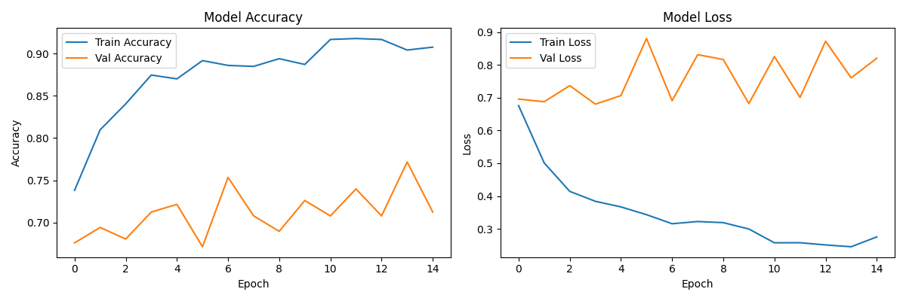

# 🫁 AI Lung Cancer Detection Tool

An AI-powered lung cancer screening tool that analyzes chest CT scans and classifies them as Normal, Benign, or Malignant — with automated next-step recommendations.

## 🔴 Live Demo
[Try it on Hugging Face Spaces](https://huggingface.co/spaces/ColeTrainCodes/lung-cancer-detector)

## 🧠 How It Works
- Trained on real CT scans from the IQ-OTH/NCCD Lung Cancer Dataset (1,097 images)
- Uses EfficientNetB0 with transfer learning from ImageNet
- Classifies scans into 3 categories: Normal, Benign, Malignant
- Generates clinical next-step recommendations based on diagnosis and confidence level

## 📊 Model Performance
- Training Accuracy: 90.45%
- Validation Accuracy: 71.23%

## 🛠️ Tech Stack
- Python
- TensorFlow / Keras
- EfficientNetB0 (Transfer Learning)
- Gradio
- Kaggle (Dataset + Training)
- Hugging Face Spaces (Deployment)

## 📁 Dataset
[IQ-OTH/NCCD Lung Cancer Dataset](https://www.kaggle.com/datasets/hamdallak/the-iqothnccd-lung-cancer-dataset) — CT scans from Iraqi hospitals, marked by oncologists and radiologists. 3 classes: Normal (416), Benign (120), Malignant (561).

## ⚠️ Disclaimer
This is a research and portfolio project only. It is not a medical device and should not be used for clinical diagnosis.
